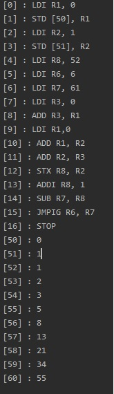
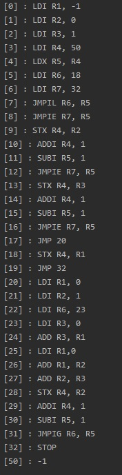
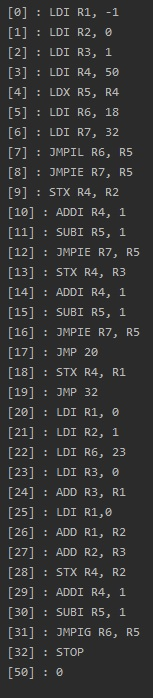
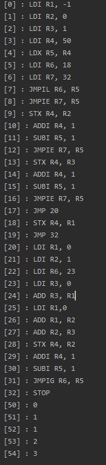
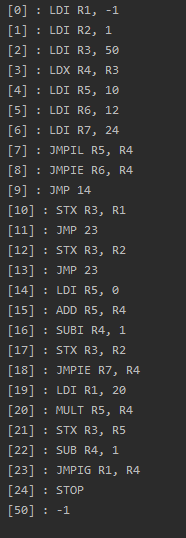
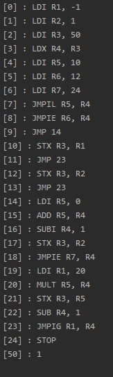
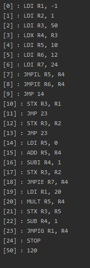
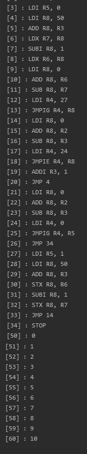

# virtual-machine-sisop

#### Trabalho da cadeira de Sistemas Operacionais - PUCRS 2020/2

## TODOS na classe APP do programa

## Integrantes

- Marcelo de Souza
- Camila Borba
- Gustavo Vidaletti
- Georgia Antunes

## Programas
Todos os programas solicitações foram feitos, não houve nenhum alteração nas instruções _(seguimos o modelo inicial proposto)_.
Os programas se encontram no diretório `src/main/resources/files/`

- `program0` - Sequência fibonacci dos 10 primeiros números
- `program1` - Sequência fibonacci de um valor **x** lido de uma posição da memória
- `program2` - fatoriade um valor **x** lido de uma posição da memória
- `program3` - Bubble sort ordena 10 posições.

Nenhum apresentou problemas a principio, foram criados testes para cada um deles e seus casos.

## VM

### Instruções para rodar a VM

- Versão do java necessário: `11 no minimo`
- Clonar o projeto e abrir em alguma IDE de preferência
- Abrir a pasta root do projeto como projeto `maven`
- Rodar o seguinte comando: `mvn clean install`

### Testes dos programas

- No diretório  `src/test/java/com/trabalho/sisop/` encontrasse a classe `VirtualMachineTest`
- Executar cada teste separadamente, pois devido a problema de concorrência dos mesmos, acabam quebrando.
- A cada execução de teste, é possível verificar o log de toda a execução do programa e as posicões de memória que foram populadas pela execução do programa.

### resultados testes

#### teste_programa_1
 

#### teste_programa_2_caso_valor_negativo
- Sequência fibonacci de um valor negativo

#### teste_programa_2_caso_valor_igual_zero
- Sequência fibonacci de 0

#### teste_programa_2_caso_valor_maior_que_zero
- Sequência fibonacci de 5 números

#### teste_programa_3_caso_valor_negativo
- Fatorial de um número negativo

#### teste_programa_3_caso_valor_igual_zero
- Fatorial de 0

#### teste_programa_3_caso_valor_maior_que_zero
- Fatorial do valor 5

#### teste_programa_4
- A carga de dados nesse teste foi feita da seguinte maneira

`memory.writeValueToMemory(50, 10);`  
`memory.writeValueToMemory(51, 9);`  
`memory.writeValueToMemory(52, 8);`  
`memory.writeValueToMemory(53, 7);`  
`memory.writeValueToMemory(54, 6);`  
`memory.writeValueToMemory(55, 5);`  
`memory.writeValueToMemory(56, 4);`  
`memory.writeValueToMemory(57, 3);`  
`memory.writeValueToMemory(58, 2);`  
`memory.writeValueToMemory(59, 1);`  
`memory.writeValueToMemory(60, 0);`  

### Observações

- A VM conta com uma memória que é representada por um array de Strings.
- Carrega as instruções do programa no inicio da memória.
- Carrega os dados apartir da posição **[50]** de memória.
- Os programas `program1`, `program2`, `program3` não fazem nenhuma carga de valores na memória para serem executados, como o `program0`,
portando se for executado o programa sem ser pelos testes criados **(que popula a memória para executar cada caso de cada programa)**, será necessário popular os valores na mão.

- Qualquer dúvida ou dificuldade em executar o programa, e também para outras finalidades como tirar dúvidas sobre o código fonte da VM, favor entrar em contato com o grupo.